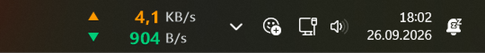
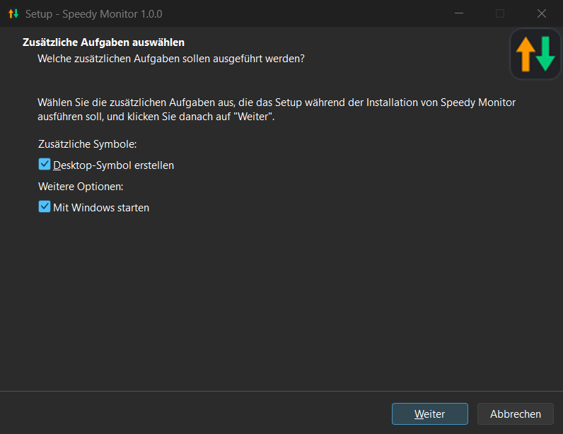
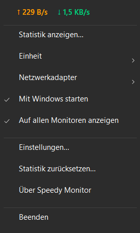
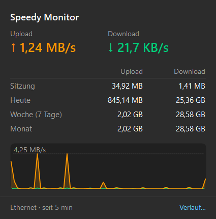
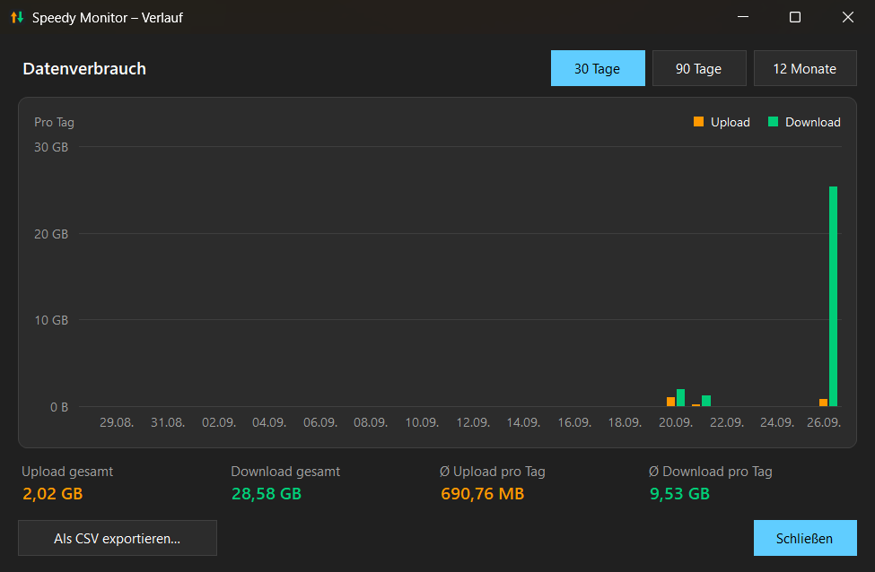
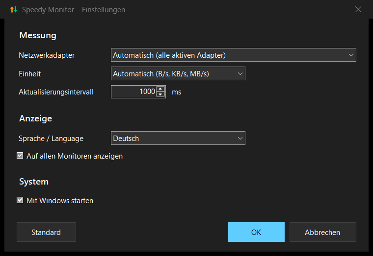

# Speedy Monitor – Anleitung

Diese Anleitung erklärt dir Schritt für Schritt, wie du Speedy Monitor
installierst, benutzt und wieder loswirst. Technisches Vorwissen brauchst du
dafür nicht.

## Inhalt

- [Was ist Speedy Monitor?](#was-ist-speedy-monitor)
- [Download – welches Setup brauche ich?](#download--welches-setup-brauche-ich)
- [Installation](#installation)
- [Erster Start](#erster-start)
- [Bedienung](#bedienung)
- [Statistik und Verlauf](#statistik-und-verlauf)
- [Einstellungen](#einstellungen)
- [Mehrere Monitore](#mehrere-monitore)
- [Spiele, Videos und andere Vollbild-Apps](#spiele-videos-und-andere-vollbild-apps)
- [Update auf eine neue Version](#update-auf-eine-neue-version)
- [Deinstallation](#deinstallation)
- [Häufige Fragen](#häufige-fragen)
- [Ein ehrlicher Hinweis zum Schluss](#ein-ehrlicher-hinweis-zum-schluss)

---

## Was ist Speedy Monitor?

Speedy Monitor zeigt dir direkt in der Taskleiste – links neben den kleinen
Symbolen bei der Uhr –, wie schnell gerade Daten durch deine
Internetverbindung bzw. dein Netzwerk fließen:

- **▲ orange** = Upload (was dein PC gerade sendet)
- **▼ grün** = Download (was dein PC gerade empfängt)

Außerdem merkt sich Speedy Monitor, wie viele Daten du heute, in der letzten
Woche und im Monat verbraucht hast, und zeigt dir auf Wunsch einen Verlauf
über bis zu zwölf Monate.

Speedy Monitor ist für **Windows 11** gemacht.

---

## Download – welches Setup brauche ich?

Auf der GitHub-Seite des Projekts findest du unter **Releases** zwei Dateien:

| Datei | Größe | Wann nehmen? |
|---|---|---|
| `SpeedyMonitor_Setup_1.0.0.exe` | klein | Wenn auf deinem PC die **.NET 8 Desktop Runtime (x64)** installiert ist bzw. du sie installieren möchtest. |
| `SpeedyMonitor_Setup_1.0.0_Standalone.exe` | deutlich größer | Funktioniert **überall ohne Zusatzinstallation** – die nötige Laufzeitumgebung ist schon eingebaut. |

**Unsicher? Nimm die Standalone-Variante.** Sie ist nur größer, kann aber
sonst genau dasselbe.

Die normale Variante prüft beim Installieren, ob die .NET 8 Desktop Runtime
vorhanden ist. Falls nicht, bietet sie dir an, die Download-Seite von
Microsoft zu öffnen. Dort lädst du unter „.NET Desktop Runtime 8“ die
Version für **Windows x64** herunter, installierst sie und startest danach
das Setup von Speedy Monitor einfach noch einmal.

---

## Installation

1. **Setup starten:** Doppelklick auf die heruntergeladene Datei.

2. **Windows-SmartScreen:** Wahrscheinlich erscheint ein blaues Fenster
   „**Der Computer wurde durch Windows geschützt**“. Das liegt daran, dass
   Speedy Monitor ein privates Hobbyprojekt ist und kein (teures)
   Code-Signatur-Zertifikat hat – Windows kennt das Programm deshalb noch
   nicht. So geht es weiter:
   - auf **„Weitere Informationen“** klicken,
   - dann auf **„Trotzdem ausführen“**.

3. **Lizenz:** Speedy Monitor steht unter der freien MIT-Lizenz. Bestätige
   sie und klicke auf **„Weiter“**.

4. **Zielordner:** Du kannst den vorgeschlagenen Ordner einfach übernehmen.
   Speedy Monitor wird nur für dein Benutzerkonto installiert (unter
   `%LocalAppData%\Programs\Speedy Monitor`) und braucht deshalb **keine
   Administratorrechte**.

5. **Zusätzliche Aufgaben:** Hier entscheidest du, ob ein Desktop-Symbol
   angelegt werden soll und ob Speedy Monitor **automatisch mit Windows
   starten** soll. Den Autostart empfehle ich – dann ist die Anzeige nach
   jedem Neustart sofort da. Beides kannst du später jederzeit ändern.

   

6. **Installieren** klicken und am Ende das Häkchen bei „Speedy Monitor
   starten“ gesetzt lassen. Fertig!

Einen Eintrag im Startmenü bekommst du automatisch.

---

## Erster Start

Nach dem Start erscheint die Anzeige in der Taskleiste deines
Hauptbildschirms, direkt **links neben den Symbolen bei der Uhr** (Netzwerk,
Lautstärke usw.):

- Es gibt **kein** zusätzliches Symbol im Infobereich – die komplette
  Bedienung läuft über die Anzeige selbst.
- Es ist egal, ob deine Taskleiste unten oder oben am Bildschirm sitzt –
  Speedy Monitor findet sie in beiden Fällen.
- Die Anzeige passt sich automatisch an den hellen oder dunklen Modus von
  Windows an.
- Wenn du Symbole im Infobereich hinzufügst oder entfernst, rückt die Anzeige
  von selbst passend nach.

---

## Bedienung

Alles läuft über die Anzeige in der Taskleiste:

| Aktion | Was passiert |
|---|---|
| **Klick** | Die Statistik öffnet sich. |
| **Doppelklick** | Die Einstellungen öffnen sich. |
| **Rechtsklick** | Ein Menü mit allen Funktionen öffnet sich. |

### Rechtsklick-Menü

- Ganz oben siehst du die aktuellen Werte für Upload und Download.
- **Statistik anzeigen…** – öffnet die Statistik (wie ein einfacher Klick).
- **Einheit ▸** – schnell die Anzeige-Einheit wechseln (siehe
  [Einstellungen](#einstellungen)).
- **Netzwerkadapter ▸** – festlegen, welche Netzwerkverbindung gemessen wird.
- **Mit Windows starten** – Autostart ein- oder ausschalten (Häkchen = an).
- **Auf allen Monitoren anzeigen** – siehe [Mehrere Monitore](#mehrere-monitore).
- **Einstellungen…** – öffnet das Einstellungsfenster (wie ein Doppelklick).
- **Statistik zurücksetzen…** – löscht nach einer Sicherheitsabfrage alle
  gesammelten Datenmengen (Sitzung, Tage, Woche und Monat). Das lässt sich
  nicht rückgängig machen.
- **Über Speedy Monitor** – Version, Entstehungsgeschichte und ein Knopf, der
  den Ordner mit deinen Einstellungen und der Statistik öffnet.
- **Beenden** – schließt Speedy Monitor. Die Anzeige verschwindet, bis du das
  Programm wieder startest (z. B. über das Startmenü).

---

## Statistik und Verlauf

### Die Statistik (ein Klick)

- **Oben:** die aktuelle Upload- und Download-Geschwindigkeit.
- **Tabelle:** wie viele Daten übertragen wurden –
  - **Sitzung:** seit Speedy Monitor zuletzt gestartet wurde,
  - **Heute:** seit Mitternacht,
  - **Woche (7 Tage):** heute und die sechs Tage davor,
  - **Monat:** seit dem 1. des aktuellen Monats.
- **Graph:** der Verlauf der letzten 60 Messungen (bei der
  Standardeinstellung also die letzte Minute). Orange = Upload, grün =
  Download.
- **Unten links:** welcher Netzwerkadapter gemessen wird und seit wann die
  Sitzung läuft.
- **Unten rechts:** der Link **„Verlauf…“**.

Die Statistik schließt sich, sobald du irgendwo anders hinklickst.

### Der Verlauf

Ein Klick auf **„Verlauf…“** öffnet ein größeres Fenster mit einem
Balkendiagramm deines Datenverbrauchs:

- Oben rechts wählst du den Zeitraum: **30 Tage**, **90 Tage** (jeweils ein
  Balkenpaar pro Tag) oder **12 Monate** (ein Balkenpaar pro Monat).
- Darunter stehen die **Summen** für Upload und Download im gewählten
  Zeitraum.
- **Ø Upload/Download pro Tag** ist der Tagesdurchschnitt. Wichtig: Gezählt
  werden dabei **nur Tage, an denen Speedy Monitor gelaufen ist**. Tage, an
  denen der PC aus war oder das Programm nicht lief, drücken den Durchschnitt
  also nicht nach unten – über sie weiß Speedy Monitor schlicht nichts.
- **Als CSV exportieren…** speichert die Tageswerte als Datei, die du z. B. in
  Excel öffnen kannst (eine Zeile pro Tag mit Datum, Upload und Download).

Die Tageswerte werden gut ein Jahr lang aufbewahrt.

> **Gut zu wissen:** Speedy Monitor kann nur zählen, solange es läuft. Wenn du
> einen lückenlosen Verlauf möchtest, schalte den Autostart ein.

---

## Einstellungen

Doppelklick auf die Anzeige (oder Rechtsklick → **Einstellungen…**):

#### Netzwerkadapter

Welche Netzwerkverbindung gemessen wird. **Automatisch (alle aktiven
Adapter)** ist für fast alle die richtige Wahl: Es werden alle aktiven
Verbindungen (LAN, WLAN …) zusammengezählt. Virtuelle Adapter von
Programmen wie Hyper-V, WSL, VirtualBox oder VMware werden dabei
ignoriert, damit nichts doppelt gezählt wird. Wenn du nur eine bestimmte
Verbindung sehen willst, kannst du sie hier gezielt auswählen.

#### Einheit

In welcher Einheit die Geschwindigkeit angezeigt wird:

- **Automatisch (B/s, KB/s, MB/s)** – wählt je nach Tempo die passende
  Einheit (Standard).
- **KB/s** oder **MB/s** – Kilo- bzw. Megabyte pro Sekunde. So zeigen
  z. B. Browser und Download-Programme das Tempo an.
- **kbit/s** oder **Mbit/s** – Kilo- bzw. Megabit pro Sekunde. So geben
  Internetanbieter die Geschwindigkeit deines Anschlusses an („100 Mbit/s“).

Faustregel: 1 Byte = 8 Bit. Ein Download mit 10 MB/s sind also etwa
80 Mbit/s.

#### Aktualisierungsintervall

Wie oft die Anzeige erneuert wird, in Millisekunden (1000 ms = 1 Sekunde).
Einstellbar von 250 bis 5000 ms, Standard ist 1000 ms.

#### Sprache / Language

In welcher Sprache Speedy Monitor seine Menüs und Fenster anzeigt:
**Automatisch (Windows-Sprache)** richtet sich nach deinem Windows – bei
deutschem Windows Deutsch, sonst Englisch. Alternativ fest **Deutsch** oder
**English**. Die Umstellung wirkt sofort nach **OK**.

#### Auf allen Monitoren anzeigen

Siehe [Mehrere Monitore](#mehrere-monitore).

#### Mit Windows starten

Speedy Monitor startet automatisch, wenn du dich bei Windows anmeldest.

#### Die Knöpfe unten

- **Standard** – setzt alle Felder auf die Grundeinstellungen zurück (wird
  erst mit OK übernommen).
- **OK** – speichert deine Änderungen.
- **Abbrechen** – schließt das Fenster, ohne etwas zu ändern.

---

## Mehrere Monitore

Normalerweise erscheint die Anzeige nur auf der Taskleiste deines
Hauptbildschirms. Wenn du mehrere Monitore hast und Windows die Taskleiste
auf allen Bildschirmen anzeigt, kannst du **Auf allen Monitoren anzeigen**
einschalten (im Rechtsklick-Menü oder in den Einstellungen). Dann bekommt
jede Taskleiste ihre eigene Anzeige – auch bei unterschiedlicher Skalierung
gestochen scharf.

---

## Spiele, Videos und andere Vollbild-Apps

Wenn du ein Spiel, ein Video oder eine andere Anwendung im Vollbild nutzt,
blendet sich Speedy Monitor automatisch aus, damit es nicht stört. Sobald du
den Vollbildmodus verlässt, ist die Anzeige wieder da.

Das Gleiche gilt, wenn du die Taskleiste in Windows automatisch ausblenden
lässt: Dann verschwindet auch die Anzeige.

Kurz verdeckt sein kann die Anzeige außerdem, solange das Startmenü, die
Suche oder die Schnelleinstellungen geöffnet sind – das ist normal.

---

## Update auf eine neue Version

Einfach das **Setup der neuen Version herunterladen und ausführen** – eine
vorherige Deinstallation ist nicht nötig. Ein laufendes Speedy Monitor wird
dabei automatisch beendet und ersetzt.

Deine **Einstellungen und deine Statistik bleiben erhalten.**

---

## Deinstallation

1. Öffne **Einstellungen → Apps → Installierte Apps**.
2. Suche **Speedy Monitor**, klicke auf die drei Punkte **„…“** und dann auf
   **„Deinstallieren“**.
3. Am Ende fragt dich das Deinstallationsprogramm, ob auch deine
   **Einstellungen und die gesammelte Statistik** gelöscht werden sollen:
   - **Ja** – alles ist restlos weg.
   - **Nein** – die Daten bleiben erhalten, und bei einer späteren
     Neuinstallation geht es nahtlos weiter.

---

## Häufige Fragen

### Ich sehe die Anzeige in der Taskleiste nicht.

- **Läuft Speedy Monitor überhaupt?** Starte es über das Startmenü (einfach
  „Speedy Monitor“ eintippen). Es läuft immer nur ein Exemplar gleichzeitig,
  doppelt starten schadet also nicht.
- **Nach einem Neustart fehlt die Anzeige?** Dann ist wahrscheinlich der
  Autostart aus. Rechtsklick auf die Anzeige → **Mit Windows starten**
  anhaken.
- **Läuft gerade ein Programm im Vollbild** oder ist die Taskleiste auf
  „automatisch ausblenden“ gestellt? Dann blendet sich die Anzeige absichtlich
  aus (siehe oben).
- **Nach einem Absturz oder Neustart des Windows-Explorers** (die Taskleiste
  verschwindet kurz und kommt wieder) kann es bis zu etwa 5 Sekunden dauern,
  bis die Anzeige wieder auftaucht.

### Windows warnt beim Installieren („Der Computer wurde durch Windows geschützt“).

Das ist bei Programmen ohne kostenpflichtige Code-Signatur normal. Klicke auf
**„Weitere Informationen“** und dann auf **„Trotzdem ausführen“**. Mehr dazu
unter [Installation](#installation).

### Das Setup meldet, dass .NET 8 fehlt.

Du hast die normale (kleine) Setup-Variante erwischt, und auf deinem PC fehlt
die **.NET 8 Desktop Runtime (x64)**. Du hast zwei Möglichkeiten:

- die Runtime von der angebotenen Microsoft-Seite installieren und das Setup
  danach erneut starten, **oder**
- einfach die **Standalone-Variante** herunterladen – die bringt alles mit.

### Wo speichert Speedy Monitor meine Daten?

Einstellungen und Statistik liegen im Ordner `%AppData%\SpeedyMonitor`.
Am einfachsten kommst du über Rechtsklick → **Über Speedy Monitor** →
**Ordner öffnen** dorthin. Das Programm selbst liegt unter
`%LocalAppData%\Programs\Speedy Monitor`.

### Schickt Speedy Monitor Daten ins Internet?

**Nein.** Speedy Monitor liest nur die Zähler aus, die Windows für deine
Netzwerkadapter ohnehin führt, und speichert die Ergebnisse ausschließlich
lokal auf deinem PC. Es gibt keine Telemetrie, keine Werbung und keine
Verbindung zu irgendeinem Server. Speedy Monitor sieht auch nicht, *was* du
überträgst – nur wie viel.

### Die angezeigten Werte weichen von meinem Speedtest ab.

Speedy Monitor zeigt den gesamten Datenverkehr deines PCs, nicht die maximale
Leistung deines Anschlusses. Achte außerdem auf die Einheit: Speedtests
rechnen in **Mbit/s**, Speedy Monitor zeigt standardmäßig **Byte** pro
Sekunde (siehe [Einheit](#einstellungen)).

---

## Ein ehrlicher Hinweis zum Schluss

Speedy Monitor ist ein **Hobbyprojekt**. Windows 11 bietet leider keine
offizielle Möglichkeit mehr, eigene Anzeigen in die Taskleiste einzubauen.
Speedy Monitor legt sich deshalb mit einem kleinen Trick passgenau über die
Taskleiste. Das funktioniert zuverlässig – es kann aber sein, dass nach einem
größeren Windows-Update eine Anpassung nötig wird. Falls dir so etwas
auffällt, melde es gern auf GitHub unter **Issues**.

Viel Spaß mit Speedy Monitor!
